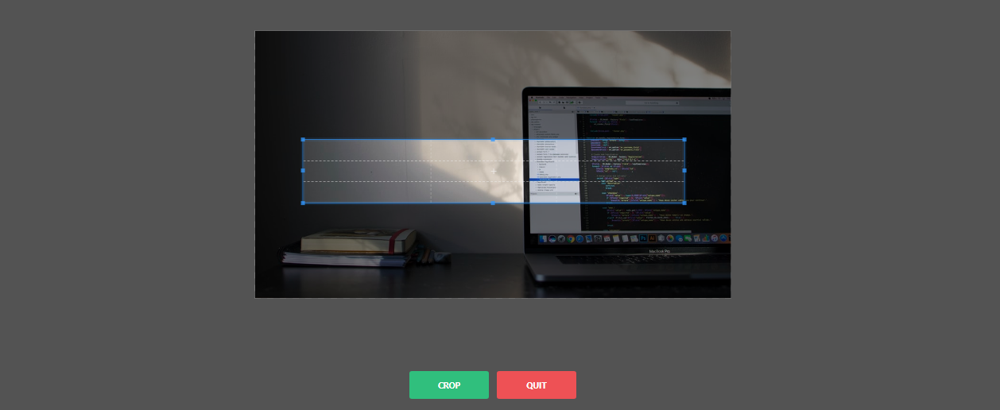

 ijaboCropTool.js 
 ================

This jQuery plugin will help you to crop images in a certain applications. You can use this plugin on the user profile page where user can use this for cropping and update profile picture or avatar. You can also use this as image resizer tool on your dashboard.


## No documentation yet!
(feel free to write a bit about it)

## Download
 Get the latest [ijaboCropTool](https://github.com/Mbere250/ijaboCropTool) plugin on [GitHub](https://github.com/) repository page.

## Dependencies
This plugin will works if is combined with the following dependency:
- [jQuery Library](https://jquery.com/)


## Customization
|       Option   |     Description    |      Usage        |
|----------------|--------------------|-------------------|
|preview|Cropped image should be displayed on a given image tags presented by class name. Just give the same class name to the image tags you need the cropped image displayed to. You can use many images with the same class name.'| preview:`'.image-class'`  |
|setRatio| This is the ratio of cropped image. by default, the ratio is `1`, but you can define your own ratio. | setRatio:`1`  setRatio:`0.5`  setRatio:`8`  setRatio:`7/8`|
|allowedExtensions| Only image extensions allowed. By default, allowed extensions are **JPG**, **JPEG**, and **PNG**. | allowedExtensions:`['jpg','png','jpeg']` |
|buttonsText| You can change action buttons text. By default The action button has **CROP** where Cancel button has **CANCEL** text.| buttonsText:`['CROP','QUIT']` |
|buttonsColor| You can customize buttons background color. Only hex code allowed. |buttonsColor:`['#30bf7d','#ee5155', -15]`|
|processUrl| This is very important option. Here you will define the process url. This should applied on core [PHP](http://php.net) projects, [Laravel](http://laravel.com) projects, [CodeIgniter](http://codeigniter.com) Projects and Other frameworks. | processUrl:`'path/to/process.php'`|
|withCSRF| Sometimes you have to add CSRF to every request. So, this plugin will allows you to do that. Just pass csrf name and hash in array if CSRF Security is enabled on your application |withCSRF:`['csrf_token','csrf_hash']` |
|fileName| You can define your own file name throught this option. Just make sure this name is similar to the file name at server side. |fileName:`'file_name'`|

## Callbacks
Sometimes you can run some tasks according to the results. Here you can see response at every process.
```JAVASCRIPT
  onSuccess:function(message, element, status){
               
    },

   onError:function(message, element, status){
               
   }

```

- **message** will be the feedback message after process.

- **element** is the selected input file.
- **status** is process response, this will give 1 if process done successfully and give 0 is process fail.

## How to use it?

# [1] - How to use this plugin in core [PHP](https://www.php.net/ 'Visit PHP Official website')


> Add This inside *head* tag

```html
  <link rel="stylesheet" href="path/to/ijaboCropTool.min.css">
```

> Add this before closing *body* tag

```html
 <script src="https://ajax.googleapis.com/ajax/libs/jquery/3.5.1/jquery.min.js"></script>
 <script src="path/to/ijaboCropTool.min.js"></script> 

```

> Add sample input file tag between *body* tag

```html
  <input type="file" name="file" id="file">
```

> After all required scripts (JQuery and ijaboCropTool Plugin), you need to add the followings:
```html
<script>
       $('#file').ijaboCropTool({
          preview : '.image-previewer',
          setRatio:1,
          allowedExtensions: ['jpg', 'jpeg','png'],
          buttonsText:['CROP','QUIT'],
          buttonsColor:['#30bf7d','#ee5155', -15],
          processUrl:'process/crop.php',
          onSuccess:function(message, element, status){
             alert(message);
          },
          onError:function(message, element, status){
            alert(message);
          }
       });
  </script>
```

> On server side
```php
   
   <?php //crop.php file
        $path = 'files/';
        $file = $_FILES['file']['tmp_name'];
        $new_image_name = 'UIMG'.date('Ymd').uniqid().'.jpg';

        if(move_uploaded_file($file, $path.$image_name)){
            echo json_encode(['status'=>1, 'msg'=>'success', 'name'=>$new_image_name]); 
        }else{
            echo json_encode(['status'=>0, 'msg'=>'failed']);
        }
   ?>     
   
```

# [2] - How to use this plugin in [Laravel](https://laravel.com/ 'Visit Laravel Official website')
Laravel is a web application framework with expressive, elegant syntax. We believe development must be an enjoyable and creative experience to be truly fulfilling. Laravel takes the pain out of development by easing common tasks used in many web projects. 

> Add This inside *head* tag

```html
  <link rel="stylesheet" href="{{ asset('path/to/ijaboCropTool.min.css') }}">
```

> Add this before closing *body* tag

```html
 <script src="https://ajax.googleapis.com/ajax/libs/jquery/3.5.1/jquery.min.js"></script> 
 <script src="{{ asset('path/to/ijaboCropTool.min.js') }}"></script> 
```

> Add sample input file tag between *body* tag

```html
  <input type="file" name="file" id="file">
```

> After all required scripts (JQuery and ijaboCropTool Plugin), you need to add the followings:
```html
<script>
       $('#file').ijaboCropTool({
          preview : '.image-previewer',
          setRatio:1,
          allowedExtensions: ['jpg', 'jpeg','png'],
          buttonsText:['CROP','QUIT'],
          buttonsColor:['#30bf7d','#ee5155', -15],
          processUrl:'{{ route("crop") }}',
          withCSRF:['_token','{{ csrf_token() }}'],
          onSuccess:function(message, element, status){
             alert(message);
          },
          onError:function(message, element, status){
            alert(message);
          }
       });
  </script>
```

>Route
```php
use App\Http\Controllers\UploadController;

 Route::get('upload',[UploadController::class, 'index']);
 Route::post('crop',[UploadController::class, 'crop'])->name('crop');
```

> On Server side.
```php
  function crop(Request $request){
      $path = 'files/';
      $file = $request->file('file');
      $new_image_name = 'UIMG'.date('Ymd').uniqid().'.jpg';
      $upload = $file->move(public_path($path), $new_image_name);
      if($upload){
          return response()->json(['status'=>1, 'msg'=>'Image has been cropped successfully.', 'name'=>$new_image_name]);
      }else{
            return response()->json(['status'=>0, 'msg'=>'Something went wrong, try again later']);
      }
    }
```

# [3] - How to use this plugin in [CodeIgniter](https://www.codeigniter.com/ 'Visit CodeIgniter Official website')
CodeIgniter is a powerful PHP framework with a very small footprint, built for developers who need a simple and elegant toolkit to create full-featured web applications.

> Place this between head tags
```html
  <link rel="stylesheet" href="<?= base_url('path/to/ijaboCropTool.min.css') ?>">
```
> Place this before closing body tag

```html
  <script src="https://ajax.googleapis.com/ajax/libs/jquery/3.5.1/jquery.min.js"></script>
  <script src="<?= base_url('path/to/ijaboCropTool.min.js') ?>"></script>
```

> Add a sample input file tag inside body tag.
```html
   <input type="file" name="file" id="file">
```

> After all required scripts (JQuery and ijaboCropTool Plugin), you need to add the followings:
```html
  <script>
      $('#file').ijaboCropTool({
          preview : '.image-previewer',
          setRatio:1,
          allowedExtensions: ['jpg', 'jpeg','png'],
          processUrl:'<?= site_url('upload/process') ?>',
          withCSRF:['<?= csrf_token() ?>','<?= csrf_hash() ?>'],
          onSuccess:function(message, element, status){
            alert(message);
          },
          onError:function(message, element, status){
            alert(message);
          }
      });   
  </script>
```
> On Server side, you will need to create a controller and method that matches to your `processUrl` Option.

```php
 function process(){
        $path = 'files/';
        $file = $this->request->getFile('file');
        $new_image_name = 'UIMG'.date('Ymd').uniqid().'.jpg';

        if($file->move($path, $image_name)){
            echo json_encode(['status'=>1, 'msg'=>'success', 'name'=>$new_image_name]); 
        }else{
            echo json_encode(['status'=>0, 'msg'=>'failed']);
        }
    }
```
> **N.B:** For CodeIgniter, You have to disable CSRF Protection on this request. To do that, you will Update Filter.php file **app\Config\Filters.php** and define URLs that are free to CSRF Protection.

```php
<?php namespace Config;

use CodeIgniter\Config\BaseConfig;

class Filters extends BaseConfig
{
	// Makes reading things below nicer,
	// and simpler to change out script that's used.
	public $aliases = [
		'csrf'     => \CodeIgniter\Filters\CSRF::class,
		'toolbar'  => \CodeIgniter\Filters\DebugToolbar::class,
		'honeypot' => \CodeIgniter\Filters\Honeypot::class,
	];

	// Always applied before every request
	public $globals = [
		'before' => [
			//'honeypot'
			// 'csrf',
			'csrf'=>[
				 "except"=>[
                    'upload/process', //upload = Controller, process = method
                    'x_controller/x_method'
				  ]
			]
		],
		'after'  => [
			'toolbar',
			//'honeypot'
		],
	];

	// Works on all of a particular HTTP method
	// (GET, POST, etc) as BEFORE filters only
	//     like: 'post' => ['CSRF', 'throttle'],
	public $methods = [];

	// List filter aliases and any before/after uri patterns
	// that they should run on, like:
	//    'isLoggedIn' => ['before' => ['account/*', 'profiles/*']],
	public $filters = [];
}


```

## License
 Copyright (c) 2021 Callixte MB. DUSENGE a.k.a Duson [Mbere250]( https://github.com/Mbere250) 


Permission is hereby granted, free of charge, to any person obtaining a copy of this software and associated documentation files (the "Software"), to deal in the Software without restriction, including without limitation the rights to use, copy, modify, merge, publish, distribute, sublicense, and/or sell copies of the Software, and to permit persons to whom the Software is furnished to do so, subject to the following conditions:

The above copyright notice and this permission notice shall be included in all copies or substantial portions of the Software.

THE SOFTWARE IS PROVIDED 'AS IS', WITHOUT WARRANTY OF ANY KIND, EXPRESS OR IMPLIED, INCLUDING BUT NOT LIMITED TO THE WARRANTIES OF MERCHANTABILITY, FITNESS FOR A PARTICULAR PURPOSE AND NONINFRINGEMENT. IN NO EVENT SHALL THE AUTHORS OR COPYRIGHT HOLDERS BE LIABLE FOR ANY CLAIM, DAMAGES OR OTHER LIABILITY, WHETHER IN AN ACTION OF CONTRACT, TORT OR OTHERWISE, ARISING FROM, OUT OF OR IN CONNECTION WITH THE SOFTWARE OR THE USE OR OTHER DEALINGS IN THE SOFTWARE.
